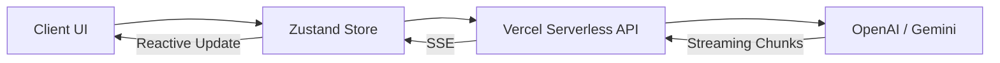

# ⚡️ PromptFlow AI

**The Neural Interface for Modern AI Productivity.**  
*A high-performance AI SaaS platform engineered for precision, scalability, and premium user experience.*

---

## 🚀 Overview

PromptFlow AI is more than just a chat interface; it's a productivity ecosystem designed to bridge the gap between complex AI models and professional workflows. Built with a focus on "genzier" aesthetics and technical depth, the platform provides a seamless, secure, and lightning-fast environment for interacting with top-tier LLMs.

**[Live Demo](https://promptflow-ai-demo.vercel.app) | [Source Code](https://github.com/yourusername/promptflow-ai)**

---

## ✨ Key Features

-   **⚡️ Real-time Neural Streaming**: High-performance AI chat with chunk-based streaming for zero-latency feedback.
-   **🤖 Multi-Model Architecture**: Intelligent routing between OpenAI (GPT-4o) and Google (Gemini 1.5 Pro) with automatic failover logic.
-   **📚 Saved Library**: A persistent knowledge base for prompts and responses, enabling rapid workflow reuse.
-   **🔗 Secure Session Sharing**: Generate shareable, encrypted links for specific conversations to collaborate effortlessly.
-   **📊 Pulse Analytics**: Real-time dashboard tracking usage metrics, prompt efficiency, and session depth.
-   **📱 Mobile-Optimized Mastery**: A fully responsive, "genzier" design featuring glassmorphism and smooth mobile drawers.

---

## 🛠 Tech Stack

| Layer               | Technology                                     |
| ------------------- | ---------------------------------------------- |
| **Frontend**        | React 19 + TypeScript + Vite                   |
| **Styling**         | Tailwind CSS (v4) + Glassmorphism Utilities    |
| **State**           | Zustand (Atomic & Persistent Store)            |
| **Animations**      | Framer Motion (Ease-out Cubic Bezier)          |
| **Backend**         | Node.js (Vercel Serverless Functions)          |
| **Infrastructure**  | Vercel (Edge Network)                          |

---

## 🏗 Architecture & Flow

PromptFlow AI follows a secure, scalable "Producer-Consumer" pattern:

1.  **Frontend (Consumer)**: React components leverage Zustand for local state and optimistic UI updates.
2.  **API Layer (Security)**: Vercel Serverless Functions act as a secure proxy to hide sensitive API keys (OpenAI/Gemini).
3.  **AI Providers (Producers)**: The system streams data back through the proxy, ensuring a responsive user experience while maintaining robust server-side validation.



---

## 📸 Interface Preview

<div align="center">
  
  
  <br />
  
  
</div>

---

## 🛡 Demo Mode & Resilience

To ensure 100% uptime, PromptFlow AI includes a **Resilience Layer**. If API limits are reached or a provider goes down:
*   The system automatically triggers a **Mock Fallback Mode** which simulates AI responses using local heuristics.
*   This allows recruiters and users to explore the interface and entire product flow even without active API credits.

---

## 💡 Why This Project Matters

This project demonstrates **Product Thinking** beyond simple coding. It addresses the core requirements of a production-ready SaaS:
-   **State Management**: Complex multi-conversation state handling without prop-drilling (Zustand).
-   **UX/DX Balance**: Premium user-facing animations paired with highly maintainable TypeScript architecture.
-   **Scalability**: Headless backend architecture that can be swapped for a full Express/Go server in minutes.

---

### 🛠 Installation

```bash
# Clone the repository
git clone https://github.com/yourusername/promptflow-ai.git

# Install dependencies
npm install

# Setup your .env
cp .env.example .env

# Run development server
npm run dev
```

---

**Built with ❤️ for the next generation of AI builders.**